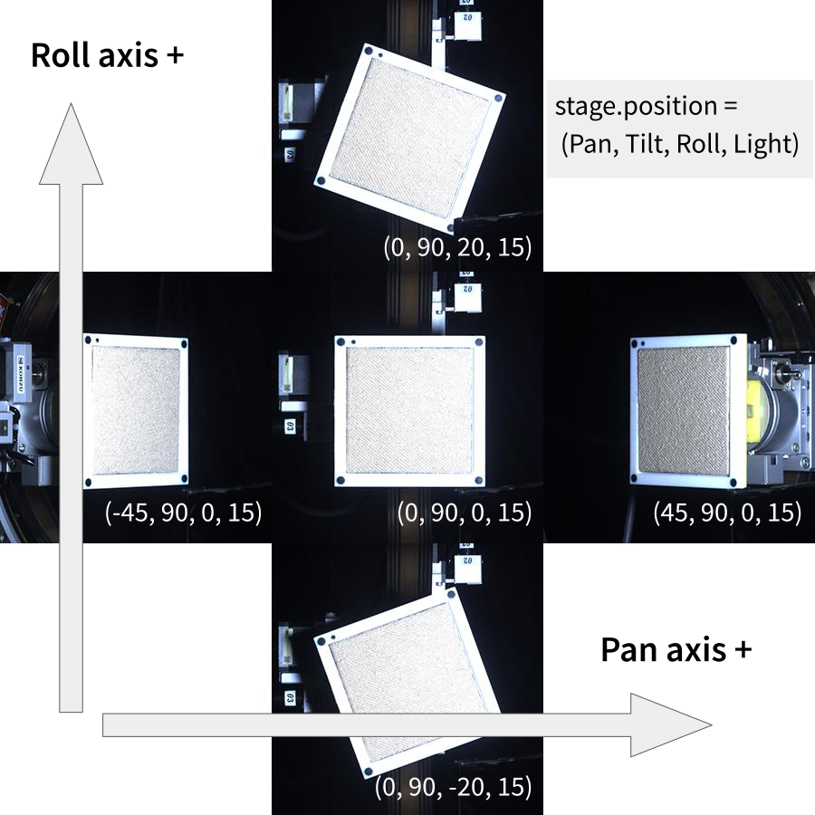
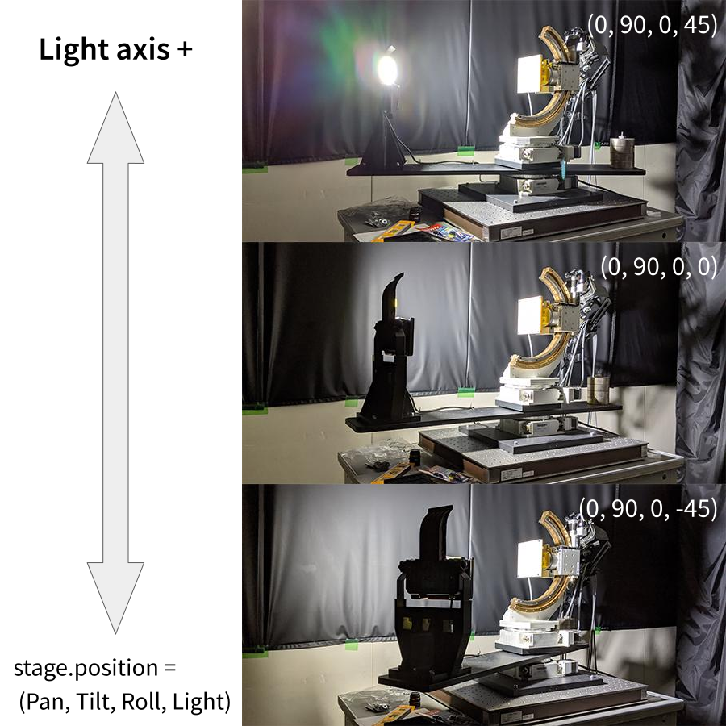

# Python製 ARIES / LYNX モーターコントローラ ラッパー
[神津精機株式会社](https://www.kohzu.co.jp/i/)さんの[ARIES / LYNX ドライバ分離型多軸モーターコントローラ](https://www.kohzu.co.jp/products/control-electronics/motor-controller-kosmos/aries-lynx/)をPythonで制御します。<br />
> An unofficial telnet wrapper for ["ARIES / LYNX" motor controller](https://www.kohzu.co.jp/products/control-electronics/motor-controller-kosmos/aries-lynx/) by [Kohzu Precision Co.,Ltd.](https://www.kohzu.co.jp/i/)

研究室の4軸ステージの制御用に作成。<br />
> This repository is intended to work with the equipment I use in my lab. This means that equipment set up for other purposes (with a different number and range of axes to operate on) will NOT work as is.

## Usage
環境次第で`pip`を`pip3`や`pipenv`、`pip install`を`poetry add`などに読み替えてください。<br />
> Depending on your environment, `pip install` should be `pip3 install`, `pipenv install`, `poetry add`, `pyflow install` etc.

### Install
```sh
pip install git+https://github.com/2-propanol/aries_python
```

### Update
```sh
pip install -U aries_python
```

### `aries`(as a command line tool)
```sh
aries --host <HOST> --port <PORT> <operation>
```
> The defaults of `HOST` and `PORT` are `192.168.1.20` and `12321`.

### `import`(as a Python module)
```python
>>> from aries import Aries
>>> stage = Aries()

>>> print(stage.position)
(0.0, 0.0, 0.0, 0.0)

>>> stage.raw_command("RPS2/4/45000/1")
>>> print(stage.position)
(0.0, 45.0, 0.0, 0.0)

>>> stage.position[2] = 10
<NG (TypeError)>
>>> stage.position = [0,45,10,0]
<OK>

>>> pos = stage.position
>>> pos[3] = 5
>>> stage.position = pos
<OK>
```

### Uninstall
```sh
pip uninstall aries_python
```

## Coordinate system


