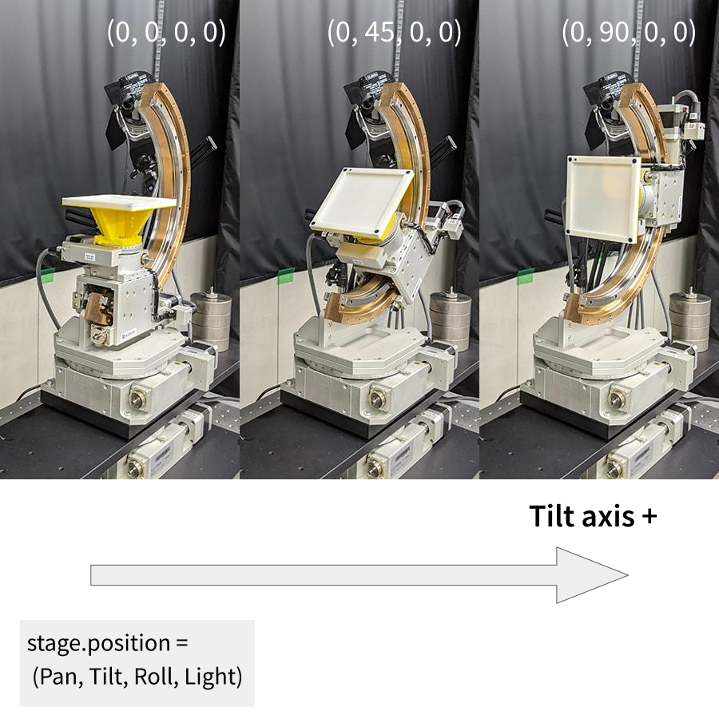
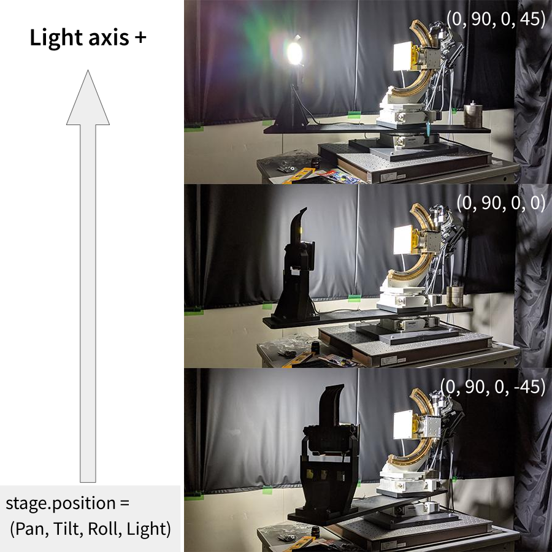

# Python製 ARIES / LYNX モーターコントローラ ラッパー
[](https://pypi.org/project/aries_controller/#history)
[](https://github.com/2-propanol/aries_controller/releases)
[](https://pypi.org/project/aries_controller/)

[神津精機株式会社](https://www.kohzu.co.jp/i/)さんの[ARIES / LYNX ドライバ分離型多軸モーターコントローラ](https://www.kohzu.co.jp/products/control-electronics/motor-controller-kosmos/aries-lynx/)をPythonで制御するためのラッパーです。
研究室の4軸ステージの制御用に作成したものです。

> An unofficial telnet wrapper for ["ARIES / LYNX" motor controller](https://www.kohzu.co.jp/products/control-electronics/motor-controller-kosmos/aries-lynx/) by [Kohzu Precision Co.,Ltd.](https://www.kohzu.co.jp/i/)
> This repository is intended to work with the equipment I use in my lab. It may not work as is on equipment set up for other purposes (with different numbers and ranges of axes to operate).

## Usage
環境次第で`pip`を`pip3`や`pipenv`、`pip install`を`poetry add`や`pyflow install`などに読み替えてください。

### Install
```sh
pip install aries-controller
```

### Update
```sh
pip install -U aries-controller
```

### `aries`(as a command line tool)
```sh
# aries --host <HOST> --port <PORT> <operation>

# transfer raw_command(reset Z axis)
aries --raw_command ORG3/7/0

# getting axis position
aries

# moving axis
aries --set_position 45/90/0/-10
aries --set_position " -45/60/180/10"
```
> The defaults of `HOST` and `PORT` are `192.168.1.20` and `12321`.

### `import`(as a Python module)
```python
>>> from aries import Aries
>>> stage = Aries()

>>> print(stage.position)
(0.0, 0.0, 0.0, 0.0)

>>> stage.raw_command("RPS2/4/45000/1")
>>> print(stage.position)
(0.0, 45.0, 0.0, 0.0)

>>> stage.position[2] = 10
<NG (TypeError)>
>>> stage.position = [0,45,10,0]
<OK>

>>> pos = stage.position
>>> pos[3] = 5
>>> stage.position = pos
<OK>
```

### Uninstall
```sh
pip uninstall aries-controller
```

## Coordinate system



